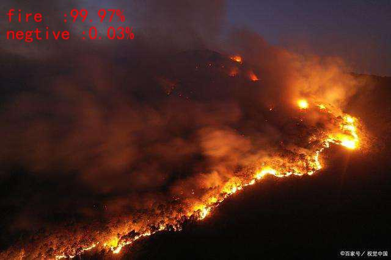
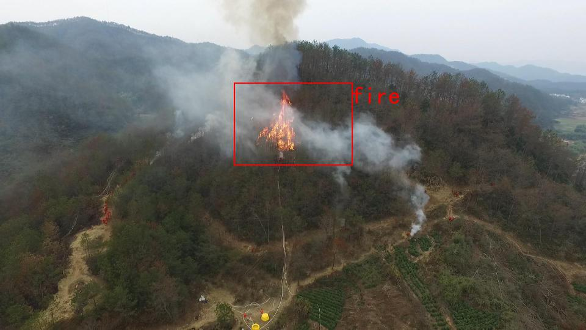
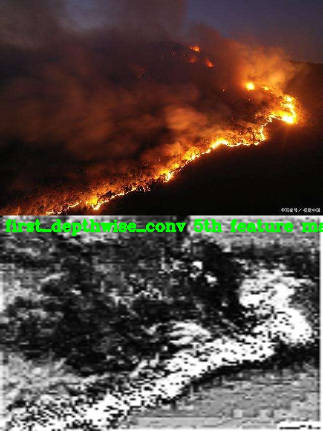
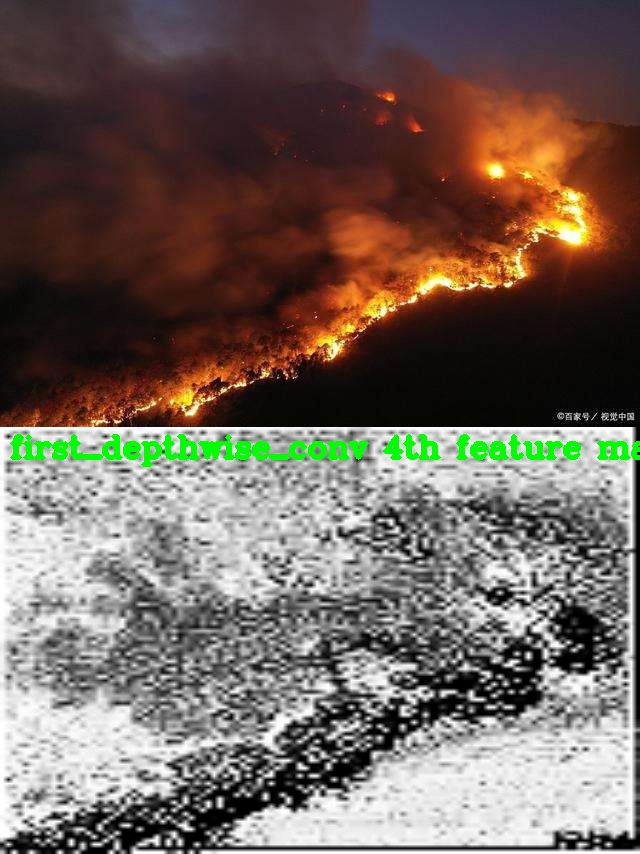
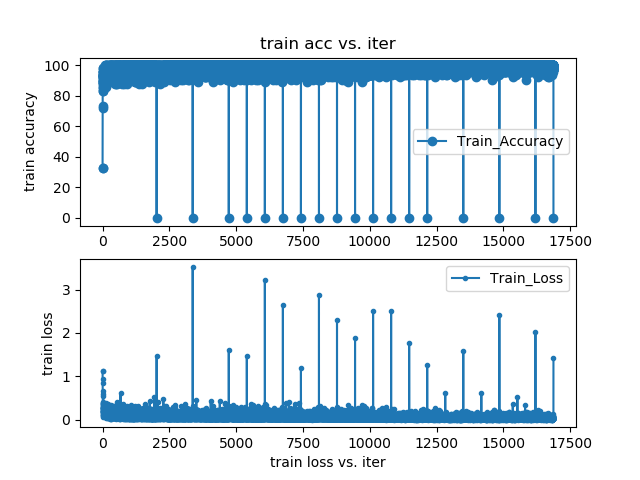

# FireSmokeDetectionByEfficientNet
[EfficientNet](https://arxiv.org/abs/1905.11946) is a wonderful classification network. the efficientnet implementation refer to [[EfficientNet-PyTorch](https://github.com/lukemelas/EfficientNet-PyTorch)](https://github.com/lukemelas/EfficientNet-PyTorch). I refer much of the code from the above implementation, and construct a network with the efficientnet feature extract layers and a fc layer of 3 output node for my fire & smoke detection task.

## 1. Introduction

Fire and smoke classification and detection by training an efficientnet classifier,detections are  implemented through classify crop patch of the input image.

## 2. Requirements

Python 3.7、PyTorch1.3...

### 3. Running demos 

Download the pretrained model and simkai.ttf font from [BaiduNetDisk:](https://pan.baidu.com/s/14CM-U6bmVjXG6gNQ2CC8fw) code: awnf

simple run:

```shell
python fire_smoke_demo.py
```

will get the classification results as follows:



or try the detection demo:

```shell
python fire_smoke_detection.py
```

will get results:



## 4. Visual the CNN 

I visual the activation of some of  the feature map as follows:





As we can see, the cnn can automatically learn the edge or shape or ROI of the predict targets, 

some of the filters can recognize the fire, some can deal with other features.

## 5. Train Custom Dataset

here offer a scrip to train ur own classification model using EfficientNet:

```shell
python train.py --data [ur dataset path] --arch [efficientnet model:efficientnet-b0-7] --num_cls [ur task class num]  
```

Refer to the cold for args details.

For inference, u should change the label map txt for ur task.

In my task:

```shell
python train.py --data ./cropdata --arch efficientnet-b0 --num_cls 3 
```



## Dataset
https://pan.baidu.com/s/1eRXtYVrn6baJ6PRMOTjyzQ code: srav
